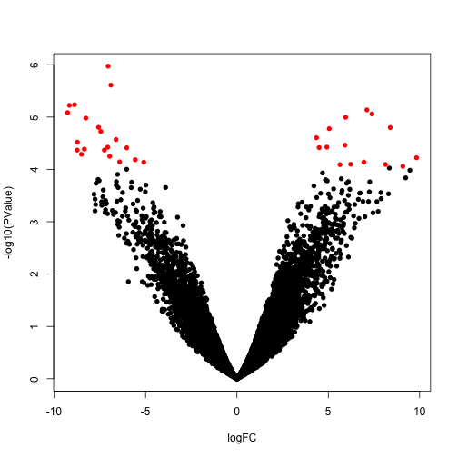
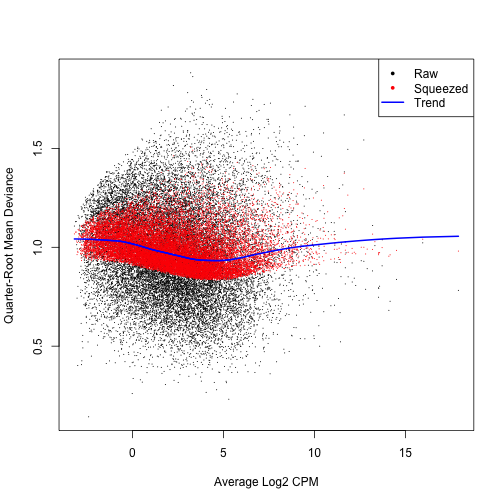
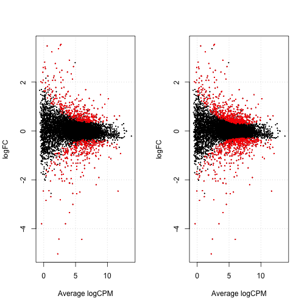
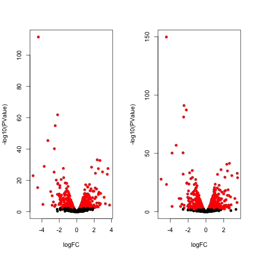

## Introduction

This presentation will show the basic usage of edgeR:

- Normalization.
- Dispersion estimate.
- Fitting GLMs.
- Testing coefficients and contrasts.
- Testing the results.


```r
# Load the data
library(ABC2018)
library(ggplot2)
theme_set(theme_minimal())
library(edgeR)
data("zebrafish")
```

## Trimming and normalizing the data.

Just as before, we started by loading, trimming and normalizing the data:


```r
# Trim 
EM_zebra <- subset(zebrafish$Expression, rowSums(zebrafish$Expression >= 5) >= 3)

# Calculate normalization factors
dge_zebra <- DGEList(EM_zebra)
dge_zebra <- calcNormFactors(dge_zebra, method="TMM")
```

## Building the model matrix

We use `model.matrix` to make a simple model matrix:


```r
mod <- model.matrix(~gallein, data=zebrafish$Design)
mod
```

```
##       (Intercept) galleintreated
## Ctl1            1              0
## Ctl3            1              0
## Ctl5            1              0
## Trt9            1              1
## Trt11           1              1
## Trt13           1              1
## attr(,"assign")
## [1] 0 1
## attr(,"contrasts")
## attr(,"contrasts")$gallein
## [1] "contr.treatment"
```

## Estimating the dispersion

Now we move on to estimating dispersion or BCV:


```r
disp_zebra <- estimateDisp(dge_zebra, design=mod, robust=TRUE)
```

The 3-step estimation is all done by a single function in the newest version of edgeR: `estimateDisp`, which replaces the three previous functions of 

- `estimateCommonDisp`
- `estimateTrendedDisp`
- `estimateTagwiseDisp`

## Plotting the dispersion

We can then plot the estimates:

```r
plotBCV(y=disp_zebra)
```


## Fiting gene-wise GLMs and testing a coefficient.

Now we can fit gene-wise GLMs:


```r
fit_zebra <- glmFit(disp_zebra, design=mod)
```

Finally, we can test a coefficient in the model for DE:


```r
# Using the name of the coefficient
gallein <- glmLRT(fit_zebra, coef="galleintreated")

# Using the index of the coefficient
gallein <- glmLRT(fit_zebra, coef=2)
```

## Inspecting the results

edgeR has several useful functions for inspecting and plotting the results:

Inspecting the top hits with `topTags`:


```r
topTags(gallein)
```

```
## Coefficient:  galleintreated 
##                        logFC      logCPM       LR       PValue        FDR
## ENSDARG00000075505 -7.050266  0.91117648 23.80888 1.063907e-06 0.02098875
## ENSDARG00000002508 -6.899411  1.98202488 22.20389 2.451759e-06 0.02296418
## ENSDARG00000091349 -8.890033  2.67150109 20.55248 5.801872e-06 0.02296418
## ENSDARG00000069441 -9.167127 -0.06217613 20.49904 5.966113e-06 0.02296418
## ENSDARG00000071565  7.114211  0.34425608 20.11517 7.291619e-06 0.02296418
## ENSDARG00000087178 -9.267206  0.03576790 19.88517 8.223557e-06 0.02296418
## ENSDARG00000040128  7.387525  6.64510937 19.77201 8.725111e-06 0.02296418
## ENSDARG00000090689  5.949190  4.67990013 19.49232 1.010048e-05 0.02296418
## ENSDARG00000000906 -8.272182  1.30746230 19.42254 1.047636e-05 0.02296418
## ENSDARG00000076643 -7.572011  0.42975453 18.64519 1.574441e-05 0.02741095
```

## Inspecting the results

Summarize the number of up- and down-regulated genes with `decideTestsDGE`:


```r
is_de <- decideTestsDGE(gallein, p.value=0.1)
head(is_de)
```

```
##                    galleintreated
## ENSDARG00000000001              0
## ENSDARG00000000002              0
## ENSDARG00000000018              0
## ENSDARG00000000019              0
## ENSDARG00000000068              0
## ENSDARG00000000069              0
```

```r
summary(is_de)
```

```
##        galleintreated
## Down               68
## NotSig          19581
## Up                 79
```

## Inspecting the results

MA-plot, showing relation between mean expression and logFC, :

```r
plotSmear(gallein, de.tags=rownames(gallein)[is_de != 0])
```


## Inspecting the results

There is no built-in function for making a volcano plot, but it's easy to do yourself:

```r
plot(-log10(PValue) ~ logFC, data = topTags(gallein, n = Inf, sort.by = "none"), 
    col = factor(decideTestsDGE(gallein) != 0), pch = 16)
```



## Quasi-likelihood: Fitting models

Recently, edgeR introduced an alternative DE pipeline using Quasi-likelihood. It should be slightly more conservative than the standard edgeR pipeline. Code-wise, though, they are almost identical:


```r
fitQL <- glmQLFit(y=disp_zebra, design=mod, robust=TRUE)
galleinQL <- glmQLFTest(fitQL, coef="galleintreated")
summary(decideTestsDGE(galleinQL, p.value=0.1))
```

```
##        galleintreated
## Down                0
## NotSig          19728
## Up                  0
```

## Quasi-likehood: Plotting dispersions

The QL-pipeline estimates slightly different dispersions:


```r
plotQLDisp(fitQL)
```



## Final exercises:

Use the above code as a template for conducting your own analysis. For the `pasilla` dataset:

- Load, trim and normalize the data
- Inspect the study design, and decide on a model matrix to use with edgeR
- Use edgeR to estimate dispersions and fit gene-wise GLMs
- Report the number of up- and down-regulated genes for the tests of interests
- Generate smear and volcano plots summarizing the analysis.
- Does the number of DE genes change when you model the batch effect or not?

If you have time:

- Investigate the effect of different normalization methods on the number of DE genes.
- Try out the QL-pipeline by replacing `glmFit` with `glmQLFit` and `glmLRT` with `glmQLFTest`

Once again - the next couple of slides contain cheat sheets...

## Cheatsheet: Experimenting with model matrices


```r
# Load the data
data("pasilla")

# This will makes "treated the intercept!"
mod <- model.matrix(~condition, data=pasilla$Design)
mod
```

```
##              (Intercept) conditionuntreated
## treated1fb             1                  0
## treated2fb             1                  0
## treated3fb             1                  0
## untreated1fb           1                  1
## untreated2fb           1                  1
## untreated3fb           1                  1
## untreated4fb           1                  1
## attr(,"assign")
## [1] 0 1
## attr(,"contrasts")
## attr(,"contrasts")$condition
## [1] "contr.treatment"
```

## Cheatsheet: Experimenting with model matrices


```r
# Relevel to make "untreated" intercept
pasilla$Design$condition <- relevel(pasilla$Design$condition, "untreated")
mod <- model.matrix(~condition, data=pasilla$Design)
mod
```

```
##              (Intercept) conditiontreated
## treated1fb             1                1
## treated2fb             1                1
## treated3fb             1                1
## untreated1fb           1                0
## untreated2fb           1                0
## untreated3fb           1                0
## untreated4fb           1                0
## attr(,"assign")
## [1] 0 1
## attr(,"contrasts")
## attr(,"contrasts")$condition
## [1] "contr.treatment"
```

## Cheatsheet: Experimenting with model matrices


```r
# Relevel to make "untreated" intercept
pasilla$Design$condition <- relevel(pasilla$Design$condition, "untreated")
mod_batch <- model.matrix(~condition+type, data=pasilla$Design)
mod_batch
```

```
##              (Intercept) conditiontreated typesingle-read
## treated1fb             1                1               1
## treated2fb             1                1               0
## treated3fb             1                1               0
## untreated1fb           1                0               1
## untreated2fb           1                0               1
## untreated3fb           1                0               0
## untreated4fb           1                0               0
## attr(,"assign")
## [1] 0 1 2
## attr(,"contrasts")
## attr(,"contrasts")$condition
## [1] "contr.treatment"
## 
## attr(,"contrasts")$type
## [1] "contr.treatment"
```

## Cheatsheet: Fitting the models

Fit and test model without batch correction:

```r
# Trim 
EM <- subset(pasilla$Expression, rowSums(pasilla$Expression >= 5) >= 3)

# Calculate normalization factors
dge <- calcNormFactors(DGEList(EM), method="TMM")

# Calculate dispersion
disp <- estimateDisp(dge, design=mod, robust=TRUE)

# Fit models
fit <- glmFit(disp, design=mod)

# Perform the test of the given coefficient
res <- glmLRT(fit, coef="conditiontreated")
```

## Cheatsheet: Fitting the models

Fit and test model without batch correction:


```r
# Calculate dispersion
disp_batch <- estimateDisp(dge, design=mod_batch, robust=TRUE)

# Fit models
fit_batch <- glmFit(disp_batch, design=mod_batch)

# Perform the test of the given coefficient
res_batch <- glmLRT(fit_batch, coef="conditiontreated")
```

## Cheatsheet: Inspecting the results

Plot dispersions

```r
par(mfrow=c(1,2))
plotBCV(disp)
plotBCV(disp_batch)
```


## Cheatsheet: Inspecting the results

Number of DE genes

```r
summary(decideTestsDGE(res))
```

```
##        conditiontreated
## Down                320
## NotSig             7728
## Up                  349
```

```r
summary(decideTestsDGE(res_batch))
```

```
##        conditiontreated
## Down                519
## NotSig             7342
## Up                  536
```

## Cheatsheet: Inspecting the results

Top genes

```r
topTags(res)
```

```
## Coefficient:  conditiontreated 
##                 logFC   logCPM       LR        PValue           FDR
## FBgn0039155 -4.408111 5.984445 506.9701 2.893583e-112 2.429742e-108
## FBgn0029167 -2.194997 8.238072 278.8209  1.356904e-62  5.696961e-59
## FBgn0035085 -2.473314 5.680246 247.0205  1.158840e-55  3.243593e-52
## FBgn0034736 -3.312828 4.059977 203.4360  3.715723e-46  7.800232e-43
## FBgn0029896 -2.569995 5.177376 179.5330  6.128996e-41  1.029304e-37
## FBgn0011260  2.350697 4.318489 147.1858  7.146857e-34  1.000203e-30
## FBgn0000071  2.659627 4.673300 145.2512  1.892539e-33  2.270236e-30
## FBgn0034434 -3.739335 3.426241 127.9909  1.127592e-29  1.183549e-26
## FBgn0001226  1.702006 6.590252 125.6806  3.611838e-29  3.369844e-26
## FBgn0040091 -1.538557 6.415788 122.1507  2.139567e-28  1.796595e-25
```

```r
topTags(res_batch)
```

```
## Coefficient:  conditiontreated 
##                 logFC    logCPM       LR        PValue           FDR
## FBgn0039155 -4.436497  5.982619 682.8152 1.631955e-150 1.370353e-146
## FBgn0026562 -2.461267 11.674381 412.8130  8.949932e-92  3.757629e-88
## FBgn0029167 -2.201287  8.237568 395.2902  5.837388e-88  1.633885e-84
## FBgn0035085 -2.500920  5.677681 367.4798  6.620961e-82  1.389905e-78
## FBgn0034736 -3.340042  4.056757 256.3267  1.084488e-57  1.821289e-54
## FBgn0029896 -2.568352  5.177267 226.6557  3.196773e-51  4.473884e-48
## FBgn0034434 -3.798349  3.412107 225.7582  5.017097e-51  6.018366e-48
## FBgn0000071  2.635277  4.675388 185.2609  3.442314e-42  3.613139e-39
## FBgn0011260  2.334747  4.320301 181.7895  1.971071e-41  1.839009e-38
## FBgn0001226  1.688841  6.590962 160.4543  9.003123e-37  7.559922e-34
```

## Cheatsheet: Inspecting the results

MA-plots:

```r
par(mfrow=c(1,2))
plotSmear(res_batch, de.tags=rownames(res)[decideTestsDGE(res) != 0])
plotSmear(res_batch, de.tags=rownames(res_batch)[decideTestsDGE(res_batch) != 0])
```



## Cheatsheet: Inspecting the results

Volcano plots:

```r
par(mfrow = c(1, 2))
plot(-log10(PValue) ~ logFC, data = topTags(res, n = Inf, sort.by = "none"), 
    col = factor(decideTestsDGE(res) != 0), pch = 16)
plot(-log10(PValue) ~ logFC, data = topTags(res_batch, n = Inf, sort.by = "none"), 
    col = factor(decideTestsDGE(res_batch) != 0), pch = 16)
```



## Cheatsheet: Quasi-likehood

Trying the more conservative QL-pipeline

```r
fitQL_batch <- glmQLFit(y=disp_batch, design=mod_batch, robust=TRUE)
testQL_batch <- glmQLFTest(fitQL_batch, coef=2)
summary(decideTestsDGE(testQL_batch, p.value=0.05))
```

```
##        conditiontreated
## Down                428
## NotSig             7542
## Up                  427
```

## Cheatsheet: Quasi-likehood

The QL-pipeline estimates slightly different dispersions:


```r
plotQLDisp(fitQL)
```


